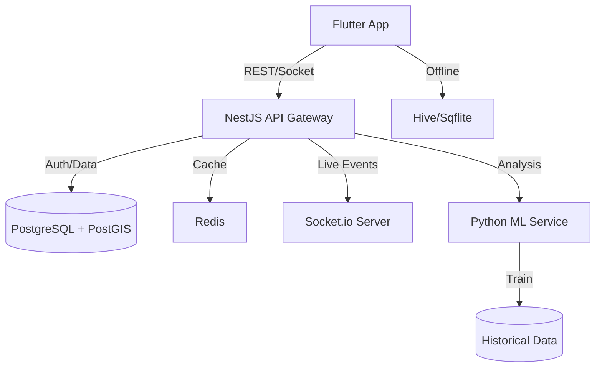

# BookMyEvent - Project Documentation

> **A Premium Wedding Planning Ecosystem for Pakistan**

## 1. Project Overview

BookMyEvent is a sophisticated, culturally-aware platform designed to modernize the Pakistani event planning industry. It bridges the gap between traditional wedding logistics and modern technology, offering offline-first capabilities, premium UI/UX, and advanced AI-driven features.

### Core Value Propositions
- **Cultural Intelligence**: Built for multi-day events (Mehndi, Barat, Walima) and detailed guest management (families vs individuals).
- **Premium Experience**: High-end aesthetics, smooth animations, and intuitive design.
- **Smart Tech**: AI budget predictions, auto-translation (Urdu/English), and vendor bidding.

---

## 2. Technical Architecture

The system follows a distributed architecture to handle scale and real-time features.

### High-Level Components



### Technology Stack

#### Frontend (Mobile App)
- **Framework**: Flutter (SDK >=3.2.0 <4.0.0)
- **State Management**: `flutter_bloc`
- **Navigation**: `go_router`
- **Networking**: `dio`, `retrofit`
- **Local Database**: `sqflite` (relational), `hive` (key-value)
- **UI Libraries**: `flutter_animate`, `lottie`, `flutter_staggered_grid_view`
- **Charts**: `fl_chart`

#### Backend Services (Planned/In-Progress)
- **Core API**: NestJS (Node.js)
- **ML Service**: Python (FastAPI/Flask) with TensorFlow/PyTorch
- **Real-time**: Socket.io
- **Queues**: Bull (Redis-based)

#### Database & Infrastructure
- **Primary DB**: PostgreSQL 14+ (Relational data, JsonB, Geospatial)
- **Cache**: Redis 7+
- **Infrastructure**: AWS / Google Cloud (S3 for media)

---

## 3. Frontend Structure

The application follows a modular, feature-first Clean Architecture.

```
lib/
├── core/                   # Shared kernel
│   ├── config/             # Environment, Routes, Assets
│   ├── network/            # Dio Factory, Interceptors
│   ├── theme/              # AppTheme, Colors, Typography
│   └── utils/              # Extensions, Formatters
│
├── features/               # Feature Modules
│   ├── analytics/          # [Active] Dashboards & Reports
│   │   ├── data/           # Models, Repositories, Services
│   │   ├── domain/         # Entities, UseCases
│   │   └── presentation/   # Pages, Widgets, BLoCs
│   │
│   ├── auth/               # Authentication (Phone/OTP)
│   ├── guests/             # Guest Management (RSVP)
│   ├── vendors/            # Marketplace & Bidding
│   ├── home/               # Navigation Shell
│   └── splash/             # Onboarding
│
└── main.dart               # Entry Point
```

---

## 4. Database Structure

The PostgreSQL schema relies on UUIDs and JSONB for flexibility.

### Key Conceptual Modules

#### A. Core Identity
- `users`: Authentication & Profiles.
- `wedding_projects`: The central entity grouping all data for a wedding.
- `events`: Individual events (e.g., Barat, Nikkah).

#### B. Vendor Marketplace
- `vendor_bid_requests`: Requirements posted by couples.
- `vendors`: Service provider profiles.
- `vendor_bids`: Responses/Proposals linked to requests.
- `bid_messages`: Chat logs for negotiation.

#### C. Smart Analytics (Data Layer)
- `budget_predictions`: ML-generated forecast records.
- `historical_wedding_analytics`: Anonymized data for training.
- `wedding_analytics_snapshots`: Time-series data points.

#### D. Social & Live
- `live_event_sessions`: Active state for "App Mode" during events.
- `social_feeds`: Content streams (photos, wishes).
- `translations`: Cached multi-lingual strings.

---

## 5. Feature Details

### 1. Analytics Dashboard (Phase 1 Implemented)
- **Status**: Frontend Complete (uses `MockAnalyticsService`).
- **Features**:
  - **Guest Stats**: Confirmed vs Invited, Bride/Groom side breakdown.
  - **Budget Tracker**: Commitments vs Payments, Categorized spending.
  - **Vendor Status**: Funnel view (Contacted -> Booked).
  - **Task Progress**: Agile-style task completion metrics.
- **Reference**: `docs/IMPLEMENTATION_SUMMARY.md`

### 2. Vendor Management & Bidding
- **Status**: In Development.
- **Concept**: A reverse marketplace where users post needs ("Catering for 500") and vendors submit bids.
- **Advanced features**:
  - Bid Comparison Matrix (Side-by-side view).
  - Automated Ranking Score (based on price, rating, similarity).

### 3. Localization (Multi-Language)
- **Status**: Designed.
- **Languages**: English, Urdu `ur`, Punjabi `pa`.
- **Implementation**: Hybrid (App-side localization + Server-side translation API).

### 4. Live Event Mode
- **Status**: Designed (Phase 3).
- **Functionality**:
  - QR Code Check-in for guests.
  - Real-time announcements (Push Notifications).
  - Live Photo Stream (Instagram style).

---

### 5. Seating Management (Spec Complete)
- **Status**: Schemas & API Designed.
- **Features**:
  - Visual Drag-and-Drop Planner.
  - Multi-Section support (VIP, Ladies, Gents).
  - AI-driven auto-assignment based on preferences (sit-with/avoid).

### 6. Payments & Finance (Spec Complete)
- **Status**: Schemas & API Designed.
- **Features**:
  - Multi-currency support (PKR, USD, GBP, AED).
  - Local Gateways: JazzCash, Easypaisa, Bank Transfer.
  - Split Payments (Bride/Groom side cost sharing).

### 7. Notification System (Spec Complete)
- **Status**: Schemas & API Designed.
- **Features**:
  - Multi-channel delivery (Push, SMS, Email, WhatsApp).
  - Intelligent scheduling & Quiet Hours.
  - Campaign/Batch management.

---

## 6. Development Setup

### Prerequisites
- **Flutter SDK**: 3.2.0+
- **Dart**: 3.2+
- **Gradle**: 8.13 (Required for Android build compatibility)

### Quick Start
1.  **Install Dependencies**:
    ```bash
    flutter pub get
    ```
2.  **Code Generation**:
    *Essential for JSON serialization and Dependency Injection.*
    ```bash
    dart run build_runner build --delete-conflicting-outputs
    ```
3.  **Run Application**:
    ```bash
    flutter run
    ```

### Documentation Links
- **Product Spec**: `docs/ADVANCED_FEATURES_SPEC.md`
- **API Spec**: `docs/API_SPECIFICATIONS.md`
- **Database**: `docs/database/advanced_features_schema.sql`

---

**Last Updated**: 2026-02-02
